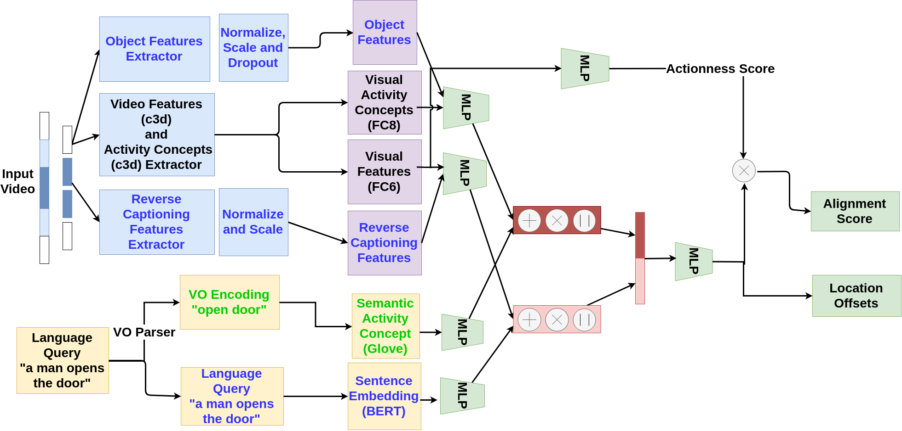

# Multi-Faceted Moment Localizer
A PyTorch implementation of Multi-Faceted Moment Localizer, an improved version of [MAC](https://arxiv.org/pdf/1811.08925.pdf) with additional features for better moment localization.
Newly introduced features include:
 - Semantic segmentation features from ADE20K [MobileNetV2dilated + C1_deepsup](https://github.com/CSAILVision/semantic-segmentation-pytorch) pretrained model.
 - Video captioning features
 - [BERT](https://arxiv.org/abs/1810.04805) Sentence Embeddings

## Training the model
1) Download "Object Segmentation Features" and "Video Understanding Features" (Video caption features) from the following link and extract to ./data directory.
   - Link: https://drive.google.com/drive/folders/1z46eCEicPI1HQzDmczC1uXD0HcZT2a-P?usp=sharing
2) Download [c3d visual features](https://drive.google.com/open?id=1vFxDw4AkGVgfILH-6xaHofLZ7PbWwFC2), [c3d visual activity concepts](https://drive.google.com/open?id=1biKPDmb7hbzowKLMIRSTLE0w_tWbGPAe), [ref_info](https://drive.google.com/open?id=16rFGu9rnhnH-WQeUmN7VtMgljrhGspll) provided by authors of MAC and extract to ./data directory.
3) Now, the data directory should have following sub directories: `all_fc6_unit16_overlap0.5`, `clip_object_features_test`, `clip_object_features_train`, `ref_info`, `test_softmax`, `train_softmax`, `video_understanding_features_test`, `video_understanding_features_train`.
4) Create a Python 2 Conda environmnt with `pytorch 0.4.1` and `torchvision`. Additionally, install following dependencies using pip.
   - `pip install pytorch_pretrained_bert`
   - `pip install numpy pickle`
5) Start training with `python train.py`

## Testing Pretrained Model
1) Follow steps 1-4 of "Training the model" section.
2) Download the pre-trained model:
   - Pre-trained model with BERT Sentence Embeddings, Glove VO Embedding, Object Segmentation Features and Video Captioning Features: [Link](https://drive.google.com/file/d/1A2NB2fyS_TTtOvaKbr6AnmKSYA5IYddr/view?usp=sharing).
 